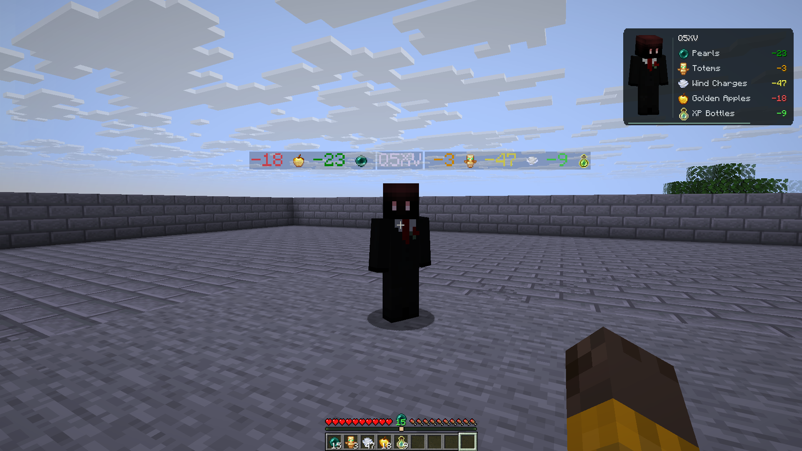

# Tallium

A client-side Fabric mod for inventory counters and player item usage.

Supports Minecraft 1.21 through 26.2, inclusive.



## Features

- HUD counters for pearls, totems, wind charges, golden apples and experience bottles.
- Item usage beside player nametags and in the player inspection popup.
- Profiles, per-item colors, cycling counters and an editable HUD layout.

## Installation

Place the release JAR in your Minecraft `mods` folder. Fabric Loader 0.19.5 or newer is required. Mod Menu is optional.

Use Java 21 or newer for Minecraft 1.21.x, and Java 25 or newer for 26.x.

## Controls

- **F12**: Open settings.
- **V**: Inspect a player.
- **F10**: Reset usage counters.

Keybindings can be changed in Minecraft Controls. `/tallium overview` lists nearby players; `/tallium check <name>` shows a player's recorded usage.

Player tracking uses the item and action information sent by the server.

## Building

Install JDK 21, JDK 25 and Python 3.12 or newer. Set `JAVA_HOME` to JDK 25, then run:

```sh
python tools/build_release.py
```

The release JAR is written to `dist/tallium-1.0/`. Run `./gradlew :core:check` to run the core tests (`gradlew.bat` on Windows).

Report bugs or suggest changes in the [issue tracker](https://github.com/5sig2/Tallium/issues).

## License

[MIT](LICENSE). Build tooling notices are in [THIRD_PARTY_NOTICES.txt](THIRD_PARTY_NOTICES.txt).
